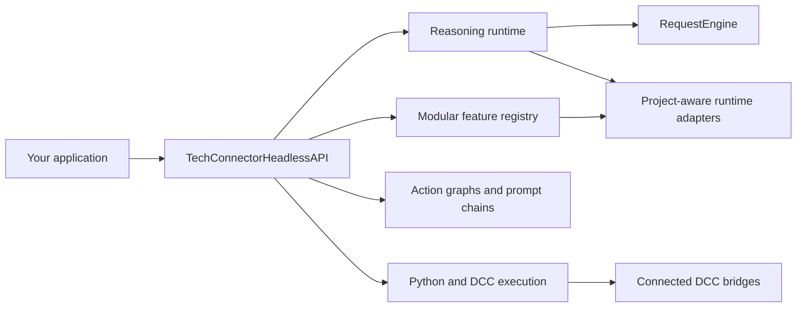
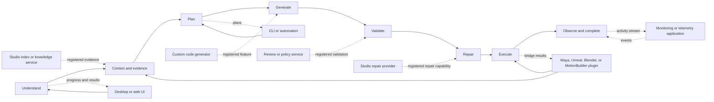

# Reasoning Runtime and Modular Feature API

This guide explains how to use Tech Connector's API version 2 reasoning
runtime, contextual threads, progress events, runtime tools, and modular feature
registry.

For the complete older headless API reference, including action graphs, prompt
chains, Python calls, and DCC calls, see [HEADLESS_API.md](HEADLESS_API.md).
For every indexed DCC function and its arguments, see
[API_FUNCTION_CATALOG.md](API_FUNCTION_CATALOG.md).

## What This API Solves

The API lets scripts, services, tests, and other applications use the same
request-understanding and routing system as Tech Connector without opening the
Qt interface.

It provides:

- Project-aware request context
- Canonical conversation history
- Request preparation and code understanding
- Deterministic request routing
- Model route selection
- Integer progress and activity events
- Validation contracts
- Runtime tool discovery
- Approval-aware tool execution
- Modular feature discovery and extension
- Existing action graph, prompt chain, Python, and DCC execution APIs

## Mental Model

The public API is divided into four layers:



Use the narrowest layer that fits the job.

| Goal | Recommended API |
| --- | --- |
| Understand and route a natural-language request | `api.reasoning.run()` |
| Inspect runtime context without dispatching | `api.reasoning.snapshot()` |
| Build sanitized request context and code understanding | `api.reasoning.prepare()` |
| Discover all current modules | `api.features.manifest()` |
| Discover one category | `api.features.list(category=...)` |
| Invoke one registered module operation | `api.features.invoke()` |
| Preview a deterministic action graph | `api.plan_prompt()` |
| Execute an approved action graph | `api.execute_action_graph()` |
| Run several natural-language steps | `api.execute_prompt_chain()` |
| Call normal Python | `api.call_function()` |
| Call Maya, Unreal, Blender, or another DCC | `api.dcc.<host>...` |

### Applications Can Attach at Any Lifecycle Stage

An application does not have to wrap the entire Tech Connector runtime.
Applications can consume or extend the specific lifecycle stages they own.
For example, a DCC plugin may contribute host context and tools, a review
service may attach to validation, and a custom UI may invoke planning and
execution without reimplementing either one.



The horizontal chain is the request lifecycle. The surrounding boxes are
applications or application-owned modules, not mandatory front ends.

| Integration need | Recommended attachment |
| --- | --- |
| Submit a complete natural-language request | `reasoning.runtime` |
| Analyze only request shape and scope | `understanding.request_frame` |
| Add thread, project, host, or permission context | `runtime.context.*` |
| Supply indexed symbols or external knowledge | `runtime.index.*`, `runtime.knowledge.*`, or `runtime.symbol_lookup.*` |
| Build or execute action graphs | `planning.action_graph` |
| Add a custom generator or studio operation | A registered `direct` feature |
| Contribute validation rules | `runtime.validation.*` |
| Execute inside a DCC | `execution.dcc` or a registered capability bridge |
| Observe progress and performance | Progress/activity events and `models.inference_telemetry` |

The feature descriptor tells a host application how it may attach:

- `access="direct"` means the application may invoke the declared operations.
- `access="owned"` means the module participates at that lifecycle stage
  through `owner_feature_id`.
- `access="internal"` means the component is visible for architecture and
  diagnostics but is not a standalone public entry point.
- `lifecycle_stage` tells graph-based UIs where the feature belongs.

A custom application feature can therefore declare its own graph placement:

```python
api.features.register(
    APIFeatureDescriptor(
        feature_id="studio.material_review",
        category="studio.review",
        version="1.0",
        description="Review generated materials before DCC execution.",
        operations=("review",),
        lifecycle_stage="validation",
        access="direct",
        source="studio_tools.material_review",
    ),
    handlers={"review": review_material},
)
```

This places the application capability at validation without forcing it to
become a complete chat client or replace the reasoning runtime.

## Authentication

The API uses the user's Tech Connector login and saved settings. It does not
require application code to contain an OpenAI, Anthropic, Google, or X API key.

```python
from tech_connector.api import create_api

api = create_api(project_root="C:/my_project")
status = api.verify_license()

if not status.get("connected"):
    raise RuntimeError(status.get("reason") or "Log in to Tech Connector first.")
```

Model-provider authentication follows the provider configuration selected in
Tech Connector. The API-selected settings are passed into the reasoning
runtime's model router.

`require_entitlement=False` is intended for status checks, diagnostics, and
tests. It should not be used to bypass execution entitlements.

## Five-Minute Quick Start

```python
from pathlib import Path

from tech_connector.api import create_api


api = create_api(project_root=Path.cwd())

result = api.reasoning.run(
    "Find the implementation of create_rig_mapping and explain its dependencies",
    context={
        "active_tab": "API",
        "project_roots": [str(Path.cwd())],
    },
)

if not result.ok:
    raise RuntimeError(result.error)

response = result.result["response"]
print("Action:", response["action"])
print("Label:", response["label"])
print(response["text"])
```

See [reasoning_quickstart.py](../examples/api/reasoning_quickstart.py) for a
runnable version.

## Understanding `APIResult`

Most operations return `APIResult`.

```python
@dataclass(frozen=True)
class APIResult:
    ok: bool
    result: Any = None
    error: str = ""
    entitlement: dict | None = None
    provenance: dict | None = None
```

Use it consistently:

```python
result = api.reasoning.snapshot("Inspect the current project")

if result.ok:
    payload = result.result
else:
    print(result.error)
```

`APIResult.to_dict()` is convenient for logs, JSON responses, and test
assertions.

## `snapshot`, `prepare`, and `run`

These operations are related but intentionally different.

### `api.reasoning.snapshot()`

Use `snapshot` to inspect the installed runtime without dispatching the request
through the full request engine.

```python
snapshot = api.reasoning.snapshot("Inspect the current project")
runtime = snapshot.result["runtime"]

print(runtime["model_route"])
print(runtime["tools"])
print(runtime["rule_sets"])
print(runtime["validation"])
```

The snapshot includes:

- Active domain context
- Interaction surface
- System instructions
- Runtime tools
- Validation reports
- Model route
- Installed rule sets
- Reasoning frame and diagnostics
- Adapter counts

### `api.reasoning.prepare()`

Use `prepare` when another component needs a sanitized `RequestContext` and the
runtime metadata attached to it.

```python
prepared = api.reasoning.prepare(
    "Explain the selected code",
    context={
        "current_file_path": "C:/project/exporter.py",
        "selection_text": "def export_fbx(...): ...",
        "extras": {
            "safe_project_label": "character_tools",
            "api_key": "this value is removed",
        },
    },
)

context = prepared.result["context"]
assert "api_key" not in context["extras"]
```

`prepare` performs code-understanding work when providers are installed. It
does not execute a mutating action.

### `api.reasoning.run()`

Use `run` to pass the request through the shared `RequestEngine`.

```python
result = api.reasoning.run("Find function export_fbx()")
response = result.result["response"]
```

The response `action` determines what happened:

| Action | Meaning |
| --- | --- |
| `answer` | A deterministic or specialized route produced an answer |
| `clarify` | Required information or approval is missing |
| `error` | The request failed and `APIResult.ok` is false |
| `passthrough` | No specialized deterministic route completed the answer |
| Other registered action | A domain provider returned a typed workflow state |

`passthrough` is not the same as a completed model answer. It means the request
engine prepared and classified the request but no specialized provider handled
it. Callers should inspect `response["prompt"]`, `response["metadata"]`, and
their configured model transport before presenting it as complete.

## Request Context

Context is optional information the calling application passes beside the
prompt. It tells Tech Connector what the user is looking at, which project may
be searched, and what prior conversation or domain state is relevant.

Context is not a second prompt, and none of its fields are required.

### Smallest Possible API Request

```python
result = api.reasoning.run("Explain how the feature registry works.")
```

Because this call came through the headless API, Tech Connector automatically
uses `"API"` as its interaction surface. The caller does not need to provide
`active_tab`.

### What `active_tab` Actually Means

`active_tab` is the original desktop-compatible name for the application area
that originated the request. It is a descriptive string, not a fixed enum and
not a requirement that the caller has tabs.

API callers should normally use the clearer `interaction_surface` alias:

```python
result = api.reasoning.run(
    "Review the selected material definition.",
    context={
        "interaction_surface": "material_review_service",
    },
)
```

The aliases below are equivalent:

```python
{"active_tab": "Pipelines"}                 # Existing desktop callers
{"interaction_surface": "Pipelines"}        # Preferred API spelling
{"surface": "Pipelines"}                    # Short API spelling
```

If the application is not an editor, pipeline, or any other example shown in
this guide, use its own meaningful name:

```python
{"interaction_surface": "asset_publish_dashboard"}
{"interaction_surface": "maya_shelf_tool"}
{"interaction_surface": "render_farm_worker"}
{"interaction_surface": "studio_review_bot"}
```

If no surface name would add useful information, omit it. The API defaults to
`"API"`. The surface is a routing/context hint; it does not restrict which
features the request may use.

### Supplying Project and Selection Context

Pass context using the `context=` argument on `snapshot`, `prepare`, or `run`:

```python
result = api.reasoning.run(
    "Explain the selected function and identify its callers.",
    context={
        "interaction_surface": "code_review_panel",
        "current_file_path": "/workspace/project/tools/exporter.py",
        "open_file_paths": [
            "/workspace/project/tools/exporter.py",
            "/workspace/project/tools/importer.py",
        ],
        "selection_text": "def export_fbx(...): ...",
        "project_roots": ["/workspace/project"],
        "index_state": "ready",
    },
)
```

| Field | Required? | What the caller enters | Default and behavior |
| --- | --- | --- | --- |
| `interaction_surface` | No | Any useful caller label, such as `maya_shelf_tool` | Preferred API-neutral alias for `active_tab`; defaults to `API` |
| `active_tab` | No | Existing desktop area such as `Editor` or `Pipelines` | Compatibility name; any string is accepted |
| `surface` | No | Short alias for `interaction_surface` | Used only when `active_tab` is absent |
| `current_file_path` | No | Absolute path to the file the user is actively viewing | Highest-priority file context; empty when no file is active |
| `open_file_paths` | No | List of other relevant absolute file paths | Empty list |
| `selection_text` | No | Exact text or code explicitly selected by the user | Empty string; do not populate with an entire file automatically |
| `project_roots` | No | Directories Tech Connector may search and index | API project root, configured active project, and tools root |
| `attached_images` | No | Local image paths available to the runtime | Empty list |
| `model` | No | Provider-qualified or configured model name | Current API/settings model |
| `index_state` | No | Caller-known state such as `ready`, `building`, or `stale` | `unknown` |
| `thread` or `messages` | No | Structured prior user/assistant turns | No prior conversation |
| `extras` | No | Additional non-secret domain data | Empty dictionary |

### Custom Context That Is Not in the Table

Applications are expected to have domain-specific state. Put it in `extras`:

```python
result = api.reasoning.run(
    "Validate this publish request.",
    context={
        "interaction_surface": "asset_publish_dashboard",
        "extras": {
            "asset_id": "character.hero",
            "publish_stage": "animation",
            "review_status": "changes_requested",
        },
    },
)
```

For convenience, unknown top-level fields are also preserved under `extras`:

```python
context = {
    "interaction_surface": "asset_publish_dashboard",
    "asset_id": "character.hero",       # Moved to extras["asset_id"]
    "publish_stage": "animation",        # Moved to extras["publish_stage"]
}
```

Explicit `extras` is recommended for public integrations because it makes the
boundary clear.

Unknown top-level context fields are preserved under `extras`.

Credential-like keys are removed recursively. This includes API keys, access
keys, secrets, tokens, passwords, credentials, authorization values, cookies,
and private keys.

### If the Request Matches No Specialized Feature

The request may still be submitted normally. Context fields describe where the
request came from; they do not enumerate the kinds of requests Tech Connector
accepts.

If no deterministic or domain provider owns the request,
`api.reasoning.run()` may return `response["action"] == "passthrough"`. That
means the request was understood and prepared but still needs the configured
model transport or a custom registered feature. It must not be presented to
the user as a completed answer.

## Contextual Threads

The API does not force the Qt transcript into memory. The caller owns the
canonical structured thread and supplies it with each request.

```python
thread = [
    {
        "role": "user",
        "content": "We are building a Maya-to-Unreal animation sync tool.",
    },
    {
        "role": "assistant",
        "content": "The current focus is clip export and Unreal import.",
    },
]

result = api.reasoning.run(
    "Now add integer progress callbacks.",
    context={"thread": thread},
)
```

After the response, append the new user and assistant turns to your stored
thread. See [thread_context_example.py](../examples/api/thread_context_example.py).

The runtime receives canonical history independently of any UI rendering limit.
For very long sessions, applications should retain:

- Recent turns verbatim
- A durable summary of older decisions and constraints
- References to generated files, assets, and symbols
- Archived full turns for search or user viewing

## Progress and Activity Events

Progress callbacks receive JSON-safe dictionaries with integer progress values.

```python
def on_progress(event):
    current = event["current"]
    total = event["total"]
    print(f'{event["stage"]}: {event["message"]} ({current}/{total})')


def on_activity(event):
    print(event["status"], event["title"], event["detail"])


result = api.reasoning.run(
    "Find every rig export implementation",
    progress_callback=on_progress,
    activity_callback=on_activity,
)
```

The same events are retained in:

```python
result.result["progress"]
result.result["activity"]
```

This supports streaming UIs, command-line progress, logs, and service status
endpoints without parsing human-readable text.

## Modular Feature Registry

The feature registry prevents the API from becoming one monolithic interface.

### List Everything

```python
manifest = api.features.manifest()

for feature in manifest["features"]:
    print(
        feature["feature_id"],
        feature["access"],
        feature["owner_feature_id"],
        feature["operations"],
    )
```

### Filter by Category

```python
contexts = api.features.list(category="runtime.context")
indexes = api.features.list(category="runtime.index")
validation = api.features.list(category="runtime.validation")
direct_features = api.features.list(access="direct")
validation_stages = api.features.list(lifecycle_stage="validation")
project_edit_modules = api.features.list(
    owner_feature_id="code.project_edit_workflow",
)
```

Category filtering includes child categories. Access, lifecycle, and owner
filters can be combined.

### Inspect One Feature

```python
feature = api.features.get("reasoning.runtime")

print(feature["description"])
print(feature["access"])
print(feature["owner_feature_id"])
print(feature["lifecycle_stage"])
print(feature["stability"])
print(feature["operations"])
print(feature["dependencies"])
print(feature["permissions"])
print(feature["source"])
```

### Invoke One Operation

```python
result = api.features.invoke(
    "runtime.context.tech_connector_context",
    "active_context",
)

print(result.result["value"])
```

Only operations declared by the descriptor can be invoked.

Features with `access == "owned"` are real modular stages, but their public
owner coordinates them so shared context, validation, and progress are not
bypassed. Features with `access == "internal"` are documented for architecture
and extension discovery; they are not standalone compatibility promises.

### Feature Descriptor

Every feature provides:

| Field | Meaning |
| --- | --- |
| `feature_id` | Stable unique identifier |
| `category` | Filterable module group |
| `version` | Feature contract version |
| `description` | Human-readable purpose |
| `access` | `direct`, `owned`, or `internal` |
| `owner_feature_id` | Public feature responsible for an owned/internal stage |
| `lifecycle_stage` | Request lifecycle location |
| `stability` | Compatibility level, normally `stable` or `internal` |
| `operations` | Allowed direct invocation operations |
| `dependencies` | Required feature IDs or categories |
| `permissions` | Required approval or entitlement labels |
| `available` | Current availability |
| `source` | Implementing Python class or module |
| `operation_schemas` | Per-operation input/output schema |
| `metadata` | Adapter-specific discovery information |

### Built-In Product Features

| Feature ID | Purpose |
| --- | --- |
| `reasoning.runtime` | Snapshot, prepare, and run requests |
| `reasoning.tools` | List and execute runtime tools |
| `planning.action_graph` | Plan and execute one action graph |
| `planning.prompt_chain` | Plan and execute sequential prompts |
| `code.pipeline_generation` | Generate pipeline Python |
| `execution.python` | Call normal Python |
| `execution.dcc` | Call a DCC function through a bridge |
| `intelligence.dcc_catalog` | Discover DCC API functions and aliases |
| `api.license` | Inspect entitlement state |

### Tech Connector Lifecycle Features

The reasoning adapters are one layer of Tech Connector, not the whole modular
system. The manifest also describes the modules used from initial request
understanding through completion:

| Feature ID | Access | Owner | Lifecycle role |
| --- | --- | --- | --- |
| `understanding.request_frame` | direct | - | Request shape, host, scope, and constraints |
| `prompt.resource_orchestration` | direct | - | Goal-aware resource and model assignment |
| `context.conversation_workspace` | direct | - | Canonical thread/workspace compatibility snapshots |
| `quality.validation_plan` | direct | - | Focused validation planning for changed paths |
| `quality.validation_intent` | direct | - | Validation-request classification |
| `intelligence.tool_discovery` | direct | - | Source-backed callable discovery |
| `prompt.stage_quality` | owned | `reasoning.runtime` | Pre-generation understanding and routing audit |
| `planning.implementation_contract` | owned | `code.project_edit_workflow` | Per-symbol plans and cross-file contracts |
| `code.project_edit_workflow` | owned | `reasoning.runtime` | Multi-file generation, project validation, and candidate production |
| `quality.project_edit_passes` | owned | `code.project_edit_workflow` | Separate syntax, import, API, signal, dead-code, behavior, and final checks |
| `repair.convergence` | owned | `reasoning.runtime` | Provider selection and monotonic validation-to-repair acceptance |
| `intelligence.project_index` | owned | `reasoning.runtime` | Persistent exact index updates and evidence |
| `models.provider_routing` | owned | `reasoning.runtime` | Local or login-backed model routing |
| `models.inference_telemetry` | owned | `reasoning.runtime` | First-token, generation, and throughput telemetry |
| `execution.adaptive_goals` | owned | `reasoning.runtime` | Per-goal evidence and confidence state |
| `execution.supervised_actions` | owned | `planning.action_graph` | Action execution and repair supervision |
| `provenance.usage` | owned | `code.pipeline_generation` | Generated-code and project provenance |
| `repair.symbol_chunks` | internal | `code.project_edit_workflow` | Exact symbol-scoped repair enforcement |
| `ui.pipeline_node_graph` | internal | `planning.action_graph` | Pipeline nodes, links, attributes, and smart menus |
| `ui.pipeline_utility_nodes` | internal | `planning.action_graph` | Built-in utility-node catalog |

This access model avoids two equally harmful extremes: hiding useful modular
capabilities, or exposing internal orchestration as if callers could safely run
it without its owner.

### Direct Lifecycle Examples

```python
frame = api.features.invoke(
    "understanding.request_frame",
    "analyze",
    prompt="Create a Maya exporter and Unreal importer.",
)

resources = api.features.invoke(
    "prompt.resource_orchestration",
    "plan",
    prompt="Create a Maya exporter and Unreal importer.",
)

checks = api.features.invoke(
    "quality.validation_plan",
    "plan",
    paths=["maya_tools/exporter.py", "unreal_tools/importer.py"],
    project_root=api.project_root,
)
```

Each call returns `APIResult`. Its serialized value is in
`result.result["value"]`.

### Automatically Registered Runtime Features

Installed runtime adapters are registered from the actual kernel:

- `runtime.context.*`
- `runtime.reasoning.*`
- `runtime.capability.*`
- `runtime.validation.*`
- `runtime.code_policy.*`
- `runtime.rules.*`
- `runtime.code_understanding.*`
- `runtime.knowledge.*`
- `runtime.index.*`
- `runtime.symbol_lookup.*`
- `runtime.escalation.*`

Passive typed providers remain independently discoverable even when their
execution is owned by `reasoning.runtime`.

## Registering a Custom Feature

There are three different customization mechanisms:

| Goal | Use |
| --- | --- |
| Add a callable operation that applications invoke explicitly | `api.features.register(...)` |
| Replace one registered feature contract in this API object | `api.features.register(..., replace=True)` |
| Add context, tools, rules, validation, knowledge, indexes, or model policy to reasoning | `create_api(runtime_packages=[...])` |

Registering a feature does not automatically insert it into every reasoning
request. Runtime packages customize the reasoning pipeline. This distinction
prevents an extension from silently changing unrelated requests.

### Add a Callable Feature

This complete example registers an operation, invokes it, checks the result,
and prints its returned value:

```python
from tech_connector.api import create_api
from tech_connector.services.api_feature_registry_service import (
    APIFeatureDescriptor,
)


def review_asset(asset_path="", ruleset="default"):
    return {
        "asset_path": asset_path,
        "ruleset": ruleset,
        "passed": True,
    }


api = create_api()
api.features.register(
    APIFeatureDescriptor(
        feature_id="studio.asset_review",
        category="studio",
        version="1.0",
        description="Review an asset against studio rules.",
        operations=("review",),
        permissions=("project_read",),
        source="studio_tools.asset_review",
        operation_schemas={
            "review": {
                "input": {
                    "asset_path": "string",
                    "ruleset": "string",
                },
                "output": "object",
            }
        },
    ),
    {"review": review_asset},
)

result = api.features.invoke(
    "studio.asset_review",
    "review",
    asset_path="/Game/Characters/SK_Hero",
    ruleset="character",
)

if not result.ok:
    raise RuntimeError(result.error)

print(result.result["value"])
# {
#     "asset_path": "/Game/Characters/SK_Hero",
#     "ruleset": "character",
#     "passed": True,
# }
```

Registration rejects:

- Empty feature IDs
- Duplicate feature IDs unless `replace=True`
- Handlers not declared in `operations`
- Invocation of unavailable features
- Invocation of undeclared operations

See [custom_feature_example.py](../examples/api/custom_feature_example.py).

### Replace a Registered Feature

Replacement is explicit and local to one `TechConnectorHeadlessAPI` instance.
It does not rewrite source files or affect other API objects.

```python
def strict_review_asset(asset_path="", ruleset="default"):
    return {
        "asset_path": asset_path,
        "ruleset": ruleset,
        "passed": bool(asset_path and ruleset != "disabled"),
        "reviewer": "strict-v2",
    }


api.features.register(
    APIFeatureDescriptor(
        feature_id="studio.asset_review",
        category="studio",
        version="2.0",
        description="Review an asset with the strict studio policy.",
        operations=("review",),
        permissions=("project_read",),
        source=f"{__name__}.strict_review_asset",
    ),
    {"review": strict_review_asset},
    replace=True,
)

result = api.features.invoke(
    "studio.asset_review",
    "review",
    asset_path="/Game/Characters/SK_Hero",
    ruleset="character",
)

assert result.ok
assert result.result["value"]["reviewer"] == "strict-v2"
```

Important replacement rules:

- Use the same `feature_id` for the feature being replaced.
- Preserve operation names and compatible arguments when existing callers must
  continue working.
- `replace=True` changes `api.features.invoke()` dispatch for that API object.
- Replacing a registry descriptor for an `owned` or `internal` stage does not
  rewire its owner. Customize the runtime through a runtime package instead.
- Create a separate feature ID when the old and new behavior should coexist.

See
[feature_replacement_example.py](../examples/api/feature_replacement_example.py).

### Customize the Reasoning Setup

A runtime package can contribute any adapter interface understood by
`ReasoningKernel`. The default Tech Connector package remains installed; the
supplied packages are added after it.

This complete example adds studio publish context:

```python
from reasoning_runtime.adapters.context_adapter import (
    ContextAdapter,
    InteractionSurface,
)
from tech_connector.api import create_api


class StudioPublishContext(ContextAdapter):
    """Supply the active studio publish state."""

    name = "studio_publish"

    def get_active_context(self):
        return {
            "asset_id": "character.hero",
            "publish_stage": "animation",
            "review_status": "changes_requested",
        }

    def get_interaction_surface(self):
        return InteractionSurface(
            kind="asset_publish_dashboard",
            supports_clarification=True,
            supports_approval=True,
        )

    def get_permission_context(self):
        return {
            "can_read_project": True,
            "can_publish": False,
        }


class StudioRuntimePackage:
    def get_context_adapters(self):
        return [StudioPublishContext()]


api = create_api(runtime_packages=[StudioRuntimePackage()])
snapshot = api.reasoning.snapshot("What publish state is active?")

if not snapshot.ok:
    raise RuntimeError(snapshot.error)

studio_context = snapshot.result["runtime"]["context"]["studio_publish"]
print(studio_context["asset_id"])
# character.hero
```

The installed adapter is also discoverable:

```python
feature = api.features.get("runtime.context.studio_publish")

assert feature["access"] == "direct"
assert "active_context" in feature["operations"]
```

Use a runtime package for:

- context adapters
- reasoning adapters and prompt overlays
- capability bridges and tools
- validation contracts
- bounded repair providers
- evidence and escalation policies
- code-intelligence adapters
- knowledge, index, and symbol-lookup providers
- rule providers, action planners, and reasoning layers

Advanced callers that already own a fully configured `ReasoningKernel` may
pass it as `runtime_kernel=kernel`. When a kernel is supplied, Tech Connector
uses it as the base and then installs any `runtime_packages`.

See
[custom_runtime_package_example.py](../examples/api/custom_runtime_package_example.py).

## Runtime Tools and Approval

Runtime tools are finer-grained than product features. Every tool advertises:

- Input and output schemas
- Mutability
- Risk
- Permissions
- Execution target
- Examples and metadata

```python
tools_result = api.reasoning.tools()
tools = tools_result.result["tools"]

for tool in tools:
    print(tool["name"], tool["mutability"], tool["risk"])
```

Preview without execution:

```python
preview = api.reasoning.execute_tool(
    "dcc.execute",
    {"host": "maya", "operation": "create_locator"},
    dry_run=True,
)
```

Mutating tools require approval:

```python
result = api.reasoning.execute_tool(
    "dcc.execute",
    {"host": "maya", "operation": "create_locator"},
    approved=True,
)
```

If `approved` is false, the API returns `APIResult(ok=False)` before calling the
bridge.

## Action Graphs and Prompt Chains

Reasoning and deterministic planning are separate operations.

```python
graph = api.plan_prompt("Find function create_rig_mapping()")
preview = api.execute_action_graph(graph, dry_run=True)
```

Execute only after review:

```python
report = api.execute_action_graph(graph, approved=True)
```

For multiple steps:

```python
result = api.execute_prompt_chain(
    [
        "Export selected Maya animation clips",
        "Import those clips into Unreal",
        "Report the imported package paths",
    ],
    dry_run=True,
)
```

## DCC Bridge Calls

Application-local packages such as `unreal`, `maya.cmds`, `bpy`, and
MotionBuilder's SDK should run inside their host process.

```python
result = api.dcc.unreal.find_assets(
    "BP_Player",
    expected_class="Blueprint",
)
```

Custom indexed function:

```python
result = api.dcc.maya.call(
    "custom_tools.animation.export_clips",
    kwargs={"output_directory": "C:/exports"},
)
```

If the required host bridge is unavailable, the call returns an error. The API
does not pretend that the host-side action completed.

## Module-Level Convenience Functions

```python
from tech_connector.api import (
    execute_runtime_tool,
    list_runtime_tools,
    prepare_reasoning_request,
    reason,
    reasoning_capabilities,
    reasoning_snapshot,
    run_reasoning,
)
```

`reason` aliases `run_reasoning`.

Constructor arguments are accepted by these functions:

- `settings`
- `project_root`
- `require_entitlement`
- `command_router`
- `licensing_context`
- `commercial_use`
- `app_major_version`

Operation-specific arguments remain separate:

```python
result = run_reasoning(
    "Inspect the active file",
    project_root="C:/project",
    context={"current_file_path": "C:/project/tool.py"},
)
```

## Error Handling

Never treat a returned object as successful without checking `ok`.

```python
result = api.reasoning.run("Do the requested work")

if not result.ok:
    print("Error:", result.error)
else:
    response = result.result["response"]
    if response["action"] == "clarify":
        print("Input required:", response["text"])
```

Common failures:

| Failure | Meaning |
| --- | --- |
| License/login error | Official API access is not currently unlocked |
| `Unknown API feature` | The feature ID is not registered |
| Undeclared operation | The feature does not expose that operation |
| Approval required | A mutating runtime tool was blocked before execution |
| Bridge unavailable | The requested DCC is not connected |
| Runtime preconditions failed | A validation contract rejected preparation |
| `passthrough` action | No specialized route produced a final answer |

## Performance Guidance

- Construct one `TechConnectorHeadlessAPI` and reuse it.
- The reasoning kernel and feature registry are initialized lazily and cached.
- Use `snapshot` for lightweight inspection.
- Use `prepare` only when code-understanding context is needed.
- Use `features.list(category=...)` instead of filtering a large manifest in
  every caller.
- Keep progress callbacks fast and non-blocking.
- Pass narrow project roots when the task is scoped.
- Use `dry_run=True` before mutating tools or action graphs.

## Migration from API Version 1

Existing calls continue to work:

```python
api.plan_prompt(...)
api.execute_action_graph(...)
api.execute_prompt_chain(...)
api.call_function(...)
api.call_dcc_function(...)
api.dcc.maya.create_rig(...)
```

API version 2 adds:

```python
api.reasoning
api.runtime
api.features
```

No API version 1 method was removed or renamed.

## Complete Examples

- [API examples overview](../examples/api/README.md)
- [Reasoning quick start](../examples/api/reasoning_quickstart.py)
- [Contextual thread](../examples/api/thread_context_example.py)
- [Feature discovery](../examples/api/feature_registry_example.py)
- [Custom feature registration](../examples/api/custom_feature_example.py)
- [Runtime tool approval](../examples/api/tool_approval_example.py)
